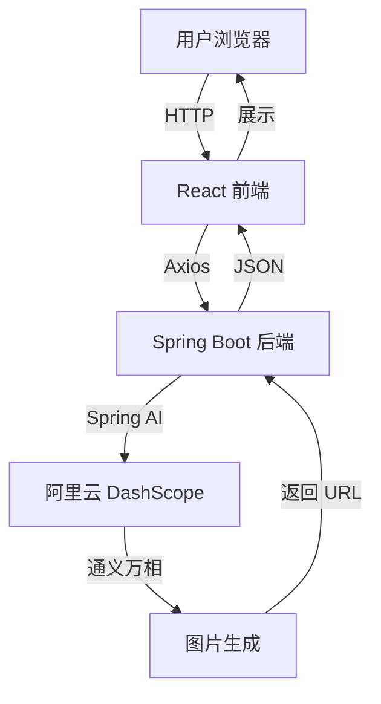

# 💖 AI 伴侣生成器

基于 React + Spring Boot + Spring AI Alibaba 的 AI 伴侣图片生成应用


---

## ✨ 快速开始

### 一键启动（推荐）

**Windows 用户**: 双击运行 `start.bat`

**其他系统**:
```bash
# 1. 配置 API Key
export DASHSCOPE_API_KEY="your-api-key"

# 2. 启动后端
cd backend && mvn spring-boot:run &

# 3. 启动前端
cd frontend && npm install && npm run dev
```

访问 http://localhost:3000 开始使用！

---

## 🎯 核心功能

### 1️⃣ 完善的信息收集
- ✅ 性别选择
- ✅ MBTI 人格测试（16 种类型）
- ✅ 出生日期（公历/农历可选）
- ✅ 自动星座计算
- ✅ 出生时间（支持未知选项）
- ✅ 出身地点和居住地（精确到区/县）

### 2️⃣ 智能兴趣匹配
- ✅ 随机拼图展示（12 种兴趣标签）
- ✅ 一键刷新选项
- ✅ 最多选择 3 个兴趣爱好

### 3️⃣ 个性化定制
- ✅ 文字描述自定义特征
- ✅ 上传参考图片
- ✅ 智能提示词组合

### 4️⃣ AI 图片生成
- ✅ 通义万相 wanx-v1 模型
- ✅ 高质量肖像照生成
- ✅ 下载和分享功能

---

## 🛠️ 技术架构



### 前端技术栈
- **框架**: React 18 + TypeScript
- **构建**: Vite
- **样式**: Tailwind CSS
- **组件**: shadcn/ui 风格
- **图标**: Lucide React
- **HTTP**: Axios

### 后端技术栈
- **语言**: Java 17
- **框架**: Spring Boot 3.2
- **AI**: Spring AI Alibaba 1.1.0-RC1
- **构建**: Maven
- **工具**: Lombok, FastJSON, Commons IO

### AI 服务
- **平台**: 阿里云 DashScope
- **模型**: 通义万相 wanx-v1
- **功能**: 文生图

---

## 📚 文档导航

| 文档 | 说明 | 适合人群 |
|------|------|----------|
| [📘 README](./README.md) | 项目介绍 | 所有人 |
| [🚀 QUICKSTART](./QUICKSTART.md) | 5 分钟快速启动 | 新手用户 |
| [👤 USER_GUIDE](./USER_GUIDE.md) | 详细使用教程 | 最终用户 |
| [🔌 API](./API.md) | API 接口文档 | 开发者 |
| [🏗️ ARCHITECTURE](./ARCHITECTURE.md) | 系统架构设计 | 架构师 |
| [📊 PROJECT_SUMMARY](./PROJECT_SUMMARY.md) | 项目总结 | 项目经理 |
| [✅ CHECKLIST](./CHECKLIST.md) | 功能验收清单 | 测试人员 |
| [📖 PROJECT_OVERVIEW](./PROJECT_OVERVIEW.md) | 完整概览 | 所有人 |

**推荐阅读顺序**: 
- **用户**: QUICKSTART → USER_GUIDE
- **开发者**: README → ARCHITECTURE → API → 源代码
- **全部概览**: PROJECT_OVERVIEW

---

## 💻 项目结构

```
ai-partner-generator/
├── 📁 backend/              # Spring Boot 后端
│   ├── pom.xml             # Maven 配置
│   ├── .env.example        # 环境变量示例
│   └── src/main/
│       ├── java/com/example/partner/
│       │   ├── controller/     # REST API
│       │   ├── service/        # 业务逻辑
│       │   ├── model/          # 数据模型
│       │   ├── dto/            # 传输对象
│       │   ├── util/           # 工具类
│       │   └── config/         # 配置类
│       └── resources/
│           └── application.yml # 应用配置
│
├── 📁 frontend/             # React 前端
│   ├── package.json        # npm 依赖
│   ├── vite.config.ts      # Vite 配置
│   ├── tsconfig.json       # TS 配置
│   ├── tailwind.config.js  # Tailwind 配置
│   └── src/
│       ├── components/     # React 组件
│       ├── services/       # API 服务
│       ├── utils/          # 工具函数
│       └── App.tsx         # 主应用
│
├── 📄 start.bat            # Windows 启动脚本
├── 📄 .gitignore           # Git 忽略规则
└── 📚 文档集合
```

---

## 🔑 必需配置

### 1. 获取 API Key

访问 [阿里云 DashScope 控制台](https://dashscope.console.aliyun.com/) 获取 API Key

### 2. 设置环境变量

**方式一：命令行**
```bash
# Linux/Mac
export DASHSCOPE_API_KEY="sk-xxxxxxxxxxxxx"

# Windows PowerShell
$env:DASHSCOPE_API_KEY="sk-xxxxxxxxxxxxx"
```

**方式二：.env 文件**
```bash
# 复制示例文件
cp backend/.env.example backend/.env

# 编辑 .env 文件，填入 API Key
```

---

## 🎨 使用示例

### 填写表单
```
性别：女
MBTI: ENFP
生日：1995-05-20 (金牛座)
时间：未知 ✓
出身：广州市天河区
居住：深圳市南山区
兴趣：摄影、旅行、美食
特征：阳光开朗，有艺术气息，喜欢冒险
```

### 生成结果
AI 将根据以上信息生成符合特征的理想伴侣形象图片。

---

## ⚡ 快速验证

### 检查环境
```bash
# Java 版本
java -version  # 应显示 17.x

# Node 版本
node -v        # 应显示 v18.x

# Maven 版本
mvn -v         # 应显示 3.6.x+
```

### 测试 API
```bash
# 后端健康检查
curl http://localhost:8080/api/zodiac?date=1990-01-01

# 预期输出：{"zodiacSign":"摩羯座"}
```

---

## ❓ 常见问题

### Q: 图片生成失败？
**A**: 检查以下几点：
1. API Key 是否正确
2. 网络连接是否正常
3. 查看后端日志错误信息

### Q: 前端无法连接后端？
**A**: 
1. 确保后端已启动（http://localhost:8080）
2. 检查 CORS 配置
3. 查看浏览器控制台错误

### Q: 农历转换准确吗？
**A**: 当前为简化实现，如需精确转换建议使用专业农历库。

### Q: 可以保存历史记录吗？
**A**: 当前版本不支持，建议下载喜欢的图片保存。

---

## 🚧 已知限制

1. **农历转换**: 简化实现，生产环境建议使用完整算法
2. **图片存储**: 本地存储，建议生产环境使用 OSS
3. **用户系统**: 暂无登录和历史记录功能
4. **缓存机制**: 未实现结果缓存

---

## 🎯 后续优化方向

### 短期
- [ ] 完善农历转换算法
- [ ] 优化错误提示
- [ ] 增加更多 MBTI 特征描述

### 中期
- [ ] 添加用户系统
- [ ] 集成 OSS 存储
- [ ] 移动端适配

### 长期
- [ ] 多模态 AI 支持
- [ ] 社交分享功能
- [ ] 个性化推荐算法

---

## 📄 许可证

MIT License

---

## 🙏 致谢

感谢以下开源项目：
- [React](https://react.dev/)
- [Spring Boot](https://spring.io/projects/spring-boot)
- [Spring AI Alibaba](https://sca.aliyun.com/)
- [shadcn/ui](https://ui.shadcn.com/)
- [通义千问](https://tongyi.aliyun.com/)

---

## 📞 获取帮助

1. 📖 查看详细文档
2. 🐛 提交 Issue
3. 💬 参与讨论

---

**开始生成您的理想伴侣吧！** 🚀

*最后更新：2024-01-XX | 版本：v0.1.0*
