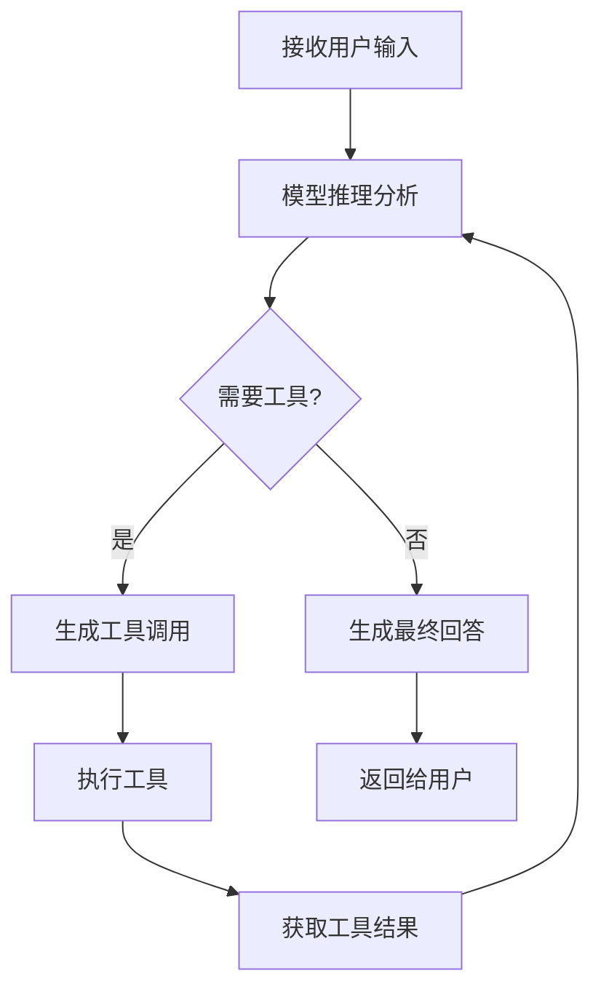

# 🤖 LangChain 智能体 (Agents) 指南

## 📋 目录

- [核心概念](#核心概念)
- [创建与配置](#创建与配置)
- [执行流程](#执行流程)
- [状态管理](#状态管理)
- [工具调用机制](#工具调用机制)
- [ReAct 循环](#react-循环)
- [系统提示词](#系统提示词)
- [重要细节与最佳实践](#重要细节与最佳实践)
- [常见问题与解决方案](#常见问题与解决方案)
- [高级功能](#高级功能)
- [智能体评估](#智能体评估)

## 🔍 核心概念

智能体是 LangChain 中最强大的组件之一，它将语言模型与工具结合，创造出能够：

- 🧠 **推理分析**：理解任务需求，制定解决方案
- 🛠️ **工具使用**：选择并调用合适的工具
- 🔄 **迭代执行**：根据反馈调整策略
- 📝 **生成回答**：提供最终解决方案

**示意图**：
```
┌─────────────┐     ┌─────────────┐     ┌─────────────┐
│  用户输入   │────>│  智能体    │────>│  工具执行   │
└─────────────┘     └─────────────┘     └─────────────┘
       ^                       │                   │
       │                       │                   │
       └───────────────────────┘<────────────────┘
                结果反馈
```

## 🚀 创建与配置

### 基本创建

```python
from langchain.agents import create_agent
from langchain_openai import ChatOpenAI

# 初始化模型
model = ChatOpenAI(
    model="gpt-4",          # 模型名称
    temperature=0.7,        # 温度参数，控制输出的随机性
    api_key="your-api-key"  # API密钥
)

# 创建智能体
agent = create_agent(
    model=model,
    tools=[],  # 工具列表，无工具时为空列表
    # 其他参数...
)
```

### 关键参数

| 参数 | 描述 | 重要性 |
|------|------|--------|
| `model` | 语言模型实例 | ⭐⭐⭐ |
| `tools` | 可用工具列表 | ⭐⭐ |
| `state_schema` | 状态模式（LangChain 1.0 要求 TypedDict） | ⭐⭐⭐ |
| `checkpointer` | 状态持久化存储 | ⭐⭐ |
| `system_prompt` | 系统提示词 | ⭐⭐⭐ |
| `middleware` | 中间件列表 | ⭐ |
| `response_format` | 响应格式 | ⭐ |
| `max_execution_time` | 最大执行时间 | ⭐ |
| `max_tool_uses` | 最大工具使用次数 | ⭐ |

### 模型选择

| 模型类型 | 特点 | 适用场景 |
|----------|------|----------|
| **OpenAI** | 功能强大，支持工具调用 | 生产环境、复杂任务 |
| **Anthropic** | 安全可靠，内容质量高 | 对安全性要求高的场景 |
| **本地模型** | 隐私保护，无API费用 | 开发测试、隐私敏感场景 |
| **开源模型** | 免费使用，可定制化 | 研究、定制化需求 |

## 🔄 执行流程

智能体的执行流程是一个循环过程，具体步骤如下：

1. **接收输入**：智能体收到用户的问题或请求
2. **模型推理**：语言模型分析输入，决定下一步行动
3. **工具调用**：如果需要，生成工具调用请求
4. **工具执行**：执行工具并获取结果
5. **结果处理**：将工具结果返回给模型
6. **循环迭代**：模型根据结果决定是否继续调用工具
7. **生成响应**：任务完成后，生成最终回答

**流程图**：


## 💾 状态管理

### 主要状态类型

| 状态类型 | 描述 | 用途 |
|----------|------|------|
| **AgentState** | 智能体核心状态 | 存储消息历史、中间结果等 |
| **Checkpoint State** | 持久化状态 | 跨会话保存状态 |
| **Tool State** | 工具执行状态 | 传递工具所需上下文 |
| **Runtime State** | 运行时状态 | 跟踪执行进度 |
| **Stream State** | 流式传输状态 | 管理实时更新 |

### 状态持久化

```python
from langgraph.checkpoint.memory import InMemorySaver
from langgraph.checkpoint.sqlite import SqliteSaver

# 内存存储（临时）
checkpointer = InMemorySaver()

# 本地持久化存储
checkpointer = SqliteSaver.from_conn_string("sqlite:///agent_states.db")

# 创建智能体时使用
agent = create_agent(
    model=model,
    tools=[],
    checkpointer=checkpointer
)
```

### 会话管理

```python
# 为每个用户创建唯一的会话ID
config = {"configurable": {"thread_id": "user_123"}}

# 第一次调用
result1 = agent.invoke(
    {"messages": [{"role": "user", "content": "你好"}]},
    config=config
)

# 第二次调用（保持上下文）
result2 = agent.invoke(
    {"messages": [{"role": "user", "content": "我的名字是什么？"}]},
    config=config
)
```

## 🛠️ 工具调用机制

### 工具定义

```python
from langchain.tools import tool
from pydantic import BaseModel, Field

class WeatherInput(BaseModel):
    location: str = Field(description="城市名称")

@tool(args_schema=WeatherInput)
def get_weather(location: str) -> str:
    """获取指定城市的天气"""
    return f"{location}的天气是晴天"
```

### 工具调用流程

1. **工具选择**：模型根据任务需求和工具描述选择合适的工具
2. **参数提取**：从用户输入中提取工具所需参数
3. **工具执行**：调用工具函数并获取结果
4. **结果处理**：工具结果被模型用于后续决策

**工具调用示例**：
```
用户: 北京的天气怎么样？
智能体: 我需要查询北京的天气信息。
工具调用: get_weather(location="北京")
工具结果: 北京的天气是晴天
智能体: 北京的天气是晴天。
```

## 🔄 ReAct 循环

智能体遵循 ReAct 模式（推理 + 行动）：

1. **推理 (Reasoning)**：分析任务，决定下一步行动
2. **行动 (Action)**：调用合适的工具
3. **观察 (Observation)**：获取工具执行结果
4. **反思 (Reflection)**：根据结果调整策略
5. **循环**：重复上述步骤直到任务完成

**ReAct 示例**：
```
用户: 北京到上海的高铁需要多长时间？

智能体: 我需要查询北京到上海的高铁信息。
行动: 调用查询高铁工具
观察: 北京到上海的高铁大约需要4-5小时
反思: 已经获取到所需信息
回答: 北京到上海的高铁大约需要4-5小时。
```

## 💬 系统提示词

### 重要性

系统提示词是塑造智能体行为的关键，它直接影响：
- 智能体的角色定位
- 工具使用的策略
- 输出的格式和风格
- 错误处理的方式

### 示例提示词

```python
system_prompt = """
你是一个专业的助手，擅长解决用户的问题。

请按照以下步骤处理任务：
1. 分析用户需求，确定需要的信息
2. 选择合适的工具获取所需信息
3. 执行工具并分析结果
4. 基于工具结果提供清晰、准确的回答

注意：
- 只使用提供的工具
- 对于不确定的信息，使用工具验证
- 保持回答简洁明了
"""
```

### 提示词优化技巧

- **明确角色**：清晰定义智能体的身份和职责
- **提供指导**：给出工具使用的具体指导
- **设定边界**：明确什么能做，什么不能做
- **格式要求**：指定输出的格式和结构
- **错误处理**：指导如何处理异常情况

## 📝 重要细节与最佳实践

### 1. 状态管理最佳实践

#### 使用 TypedDict 定义状态模式
LangChain 1.0 要求使用 `TypedDict` 定义状态模式，这是最佳实践：

```python
from typing import TypedDict, List, Dict, Any

# 定义自定义状态
class CustomState(TypedDict):
    messages: List[Dict[str, Any]]  # 消息历史
    user_name: str  # 用户姓名
    conversation_count: int  # 对话次数

# 创建智能体时使用
agent = create_agent(
    model=model,
    tools=[],
    state_schema=CustomState  # 指定状态模式
)
```

#### 状态结构设计
- **保持简洁**：只包含必要的状态字段
- **分组管理**：相关信息放在一起
- **避免嵌套过深**：复杂状态会增加管理难度
- **类型明确**：为每个字段指定清晰的类型

#### 状态持久化策略
- **开发测试**：使用 `InMemorySaver`
- **本地应用**：使用 `SqliteSaver`
- **生产环境**：使用 `RedisSaver` 或 `PostgresSaver`
- **会话管理**：为每个用户使用唯一的 `thread_id`

### 2. 性能优化

#### 工具调用优化
- **工具缓存**：对频繁调用的工具结果进行缓存
- **批量处理**：合并多个工具调用为批量操作
- **异步执行**：使用异步工具提高并发性能
- **超时设置**：为工具调用设置合理的超时时间

#### 模型优化
- **温度参数**：根据任务类型调整 `temperature`
  - 创意任务：0.7-0.9
  - 事实性任务：0.1-0.3
- **最大令牌**：设置合理的 `max_tokens`
- **模型选择**：根据任务复杂度选择合适的模型

#### 上下文管理
- **消息压缩**：对长对话进行摘要
- **上下文窗口**：监控并管理上下文长度
- **关键信息提取**：只保留重要的对话内容

### 3. 错误处理

#### 工具错误处理
```python
from langchain.tools import tool

@tool
def get_weather(location: str) -> str:
    """获取指定城市的天气"""
    try:
        # 工具实现
        return f"{location}的天气是晴天"
    except Exception as e:
        return f"获取天气失败: {str(e)}"
```

#### 智能体错误处理
- **异常捕获**：捕获并处理执行过程中的异常
- **降级策略**：当工具调用失败时提供备选方案
- **错误提示**：向用户提供清晰的错误信息
- **重试机制**：对临时性错误实现重试逻辑

#### 监控与日志
- **执行日志**：记录智能体的执行过程
- **性能监控**：跟踪执行时间和资源使用
- **错误统计**：分析常见错误类型和原因

### 4. 调试技巧

#### 流式输出
```python
# 使用 updates 模式查看详细执行过程
for chunk in agent.stream(
    {"messages": [{"role": "user", "content": "你好"}]},
    stream_mode="updates"
):
    print(chunk)
```

#### 中间件调试
```python
from langchain.agents.middleware import before_model, after_model

@before_model
def debug_before_model(state, runtime):
    print(f"执行前状态: {state}")
    return None

@after_model
def debug_after_model(state, runtime):
    print(f"执行后状态: {state}")
    return None

# 创建智能体时添加中间件
agent = create_agent(
    model=model,
    tools=[],
    middleware=[debug_before_model, debug_after_model]
)
```

#### 工具调用跟踪
- **工具调用日志**：记录每次工具调用的参数和结果
- **执行时间**：测量工具执行的时间
- **调用频率**：监控工具的调用频率

### 5. 系统提示词优化

#### 提示词结构
1. **角色定义**：明确智能体的身份和职责
2. **任务描述**：详细说明任务目标
3. **工具使用指南**：指导如何使用工具
4. **输出格式**：指定输出的格式要求
5. **边界条件**：明确什么能做，什么不能做

#### 提示词示例
```python
system_prompt = """
你是一个专业的天气助手，擅长回答关于天气的问题。

任务：
- 回答用户关于天气的问题
- 使用提供的天气工具获取最新信息
- 提供清晰、准确的回答

工具使用指南：
- 当用户询问特定城市的天气时，使用 get_weather 工具
- 工具需要 location 参数（城市名称）
- 分析工具结果并以友好的方式呈现给用户

输出格式：
- 回答要简洁明了
- 包含温度、天气状况等关键信息
- 提供相关建议（如穿衣、出行等）

注意：
- 只回答与天气相关的问题
- 对于不确定的信息，使用工具验证
- 保持专业、友好的语气
"""
```

### 6. 部署与扩展

#### 部署策略
- **容器化**：使用 Docker 容器化部署
- **扩展方案**：根据负载水平扩展实例
- **监控告警**：设置关键指标的监控和告警
- **健康检查**：实现健康检查端点

#### 多智能体系统
- **任务分工**：不同智能体负责不同领域
- **协作机制**：智能体之间的信息传递
- **协调器**：管理多智能体的协作

#### 安全考虑
- **输入验证**：验证用户输入，防止注入攻击
- **工具权限**：限制工具的访问权限
- **敏感信息**：避免存储和处理敏感信息
- **速率限制**：防止 API 滥用

## 🐛 常见问题与解决方案

| 问题 | 原因 | 解决方案 |
|------|------|----------|
| 工具调用失败 | 工具参数错误 | 检查参数格式和类型，添加参数验证 |
| 无限循环 | 工具结果未满足模型预期 | 添加循环检测和终止条件，设置最大工具使用次数 |
| 状态丢失 | 未使用 checkpointer | 配置合适的 checkpointer，使用 thread_id 管理会话 |
| 响应缓慢 | 模型或工具执行时间长 | 优化工具实现，设置超时，使用异步工具 |
| 工具选择错误 | 工具描述不够清晰 | 改进工具描述，提供更详细的说明和示例 |
| 上下文溢出 | 消息历史过长 | 实现消息压缩，只保留关键信息 |
| API 限额超限 | 请求频率过高 | 实现速率限制，添加缓存机制 |
| 输出格式错误 | 提示词不够明确 | 改进系统提示词，提供具体的格式示例 |

## 🚀 高级功能

### 1. 多智能体协作

```python
from langchain.agents import create_agent
from langchain_openai import ChatOpenAI

# 创建多个专业智能体
weather_agent = create_agent(
    model=ChatOpenAI(model="gpt-4"),
    tools=[get_weather],
    system_prompt="你是一个专业的天气助手"
)

finance_agent = create_agent(
    model=ChatOpenAI(model="gpt-4"),
    tools=[get_stock_price],
    system_prompt="你是一个专业的金融助手"
)

# 智能体协调器
def agent_coordinator(query):
    if "天气" in query:
        return weather_agent.invoke({"messages": [{"role": "user", "content": query}]})
    elif "股票" in query:
        return finance_agent.invoke({"messages": [{"role": "user", "content": query}]})
    else:
        return {"messages": [{"role": "assistant", "content": "请提供更具体的问题"}]}
```

### 2. 工具链

```python
from langchain.tools import tool

@tool
def search_web(query: str) -> str:
    """搜索网络获取信息"""
    return f"搜索结果: {query} 的相关信息"

@tool
def summarize(text: str) -> str:
    """总结文本内容"""
    return f"总结: {text[:50]}..."

# 工具链使用
def research_agent(query):
    # 第一步：搜索信息
    search_result = search_web(query)
    # 第二步：总结结果
    summary = summarize(search_result)
    return summary
```

### 3. 条件工具使用

```python
from langchain.tools import tool

@tool
def get_weather(location: str) -> str:
    """获取指定城市的天气"""
    return f"{location}的天气是晴天"

@tool
def get_forecast(location: str) -> str:
    """获取指定城市的天气预报"""
    return f"{location}未来3天的天气都是晴天"

# 条件工具使用
def weather_assistant(query):
    if "预报" in query or "未来" in query:
        return get_forecast(query)
    else:
        return get_weather(query)
```

## 📊 智能体评估

### 评估指标
- **任务完成率**：成功完成任务的比例
- **工具使用准确率**：正确选择和使用工具的比例
- **响应质量**：回答的准确性和有用性
- **执行时间**：完成任务的平均时间
- **错误率**：执行过程中的错误率

### 评估方法
1. **人工评估**：由人类评估智能体的表现
2. **自动评估**：使用基准测试数据集
3. **A/B 测试**：比较不同配置的性能
4. **用户反馈**：收集实际用户的反馈

### 持续改进
- **定期评估**：定期评估智能体的性能
- **反馈循环**：根据评估结果调整配置
- **模型更新**：及时更新模型版本
- **工具优化**：改进工具的实现和描述

## 🎯 最佳实践总结

1. **明确目标**：为智能体设定清晰的任务目标
2. **合理配置**：根据任务类型选择合适的模型和参数
3. **工具设计**：创建功能明确、描述清晰的工具
4. **状态管理**：使用 TypedDict 定义状态，合理使用 checkpointer
5. **错误处理**：实现全面的错误处理和降级策略
6. **性能优化**：优化工具调用和模型使用
7. **监控日志**：建立完善的监控和日志系统
8. **持续改进**：根据反馈不断优化智能体性能

---

*本指南持续更新中，欢迎贡献和反馈！*