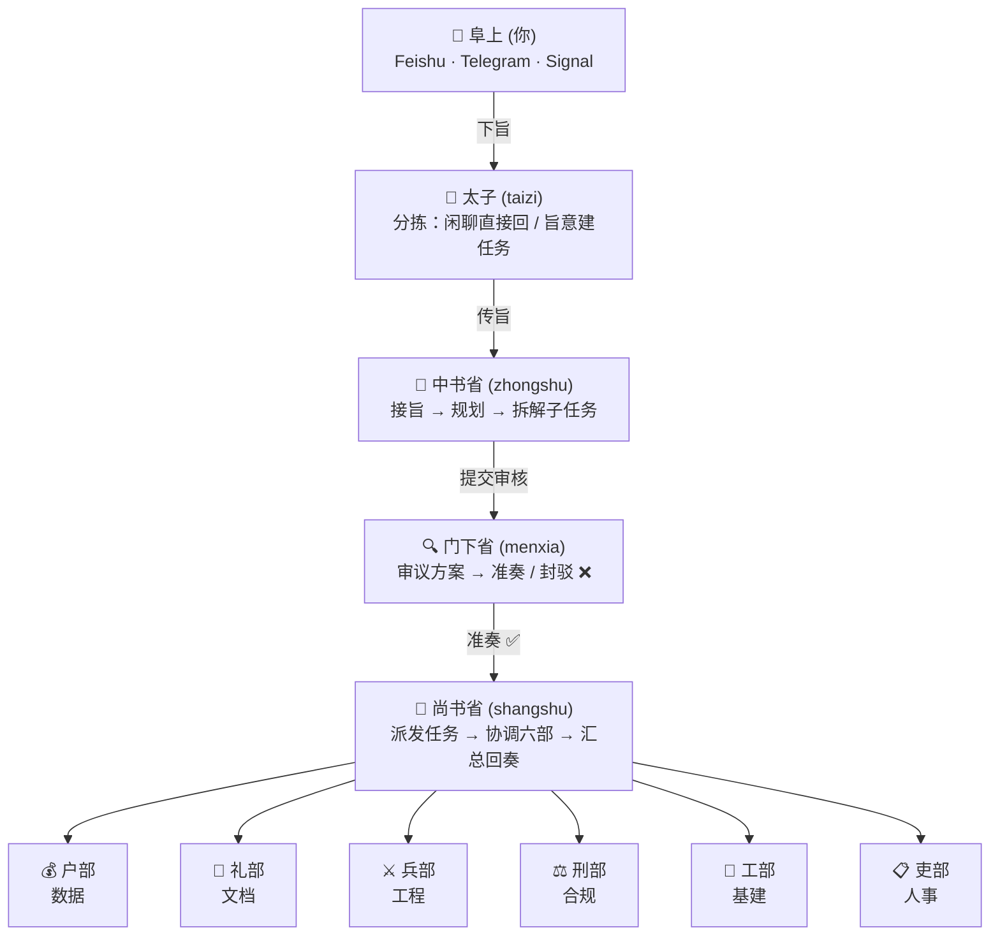

# 组织架构

- 各省部职责说明

| 部门 | Agent ID | 职责 | 擅长领域 |
|------|----------|------|----------|
| 💎 太子 | taizi | 消息分拣、需求整理 | 闲聊识别、旨意提炼、标题概括 |
| 📜 中书省 | zhongshu | 接旨、规划、拆解 | 需求理解、任务分解、方案设计 |
| 🔍 门下省 | menxia | 审议、把关、封驳 | 质量评审、风险识别、标准把控 |
| 📢 尚书省 | shangshu | 派发、协调、汇总 | 任务调度、进度跟踪、结果整合 |
| 💰 户部 | hubu | 数据、资源、核算 | 数据处理、报表生成、成本分析 |
| 📄 礼部 | libu | 文档、规范、报告 | 技术文档、API 文档、规范制定 |
| ⚔️ 兵部 | bingbu | 代码、算法、巡检 | 功能开发、Bug 修复、代码审查 |
| ⚖️ 刑部 | xingbu | 安全、合规、审计 | 安全扫描、合规检查、红线管控 |
| 🔧 工部 | gongbu | CI/CD、部署、工具 | Docker 配置、流水线、自动化 |
| 📋 吏部 | libu_hr | 人事、Agent 管理 | Agent 注册、权限维护、培训 |
| 🗓️ 早朝官 | zaochao | 每日早朝、新闻聚合 | 定时播报、数据汇总 |

- 代码

